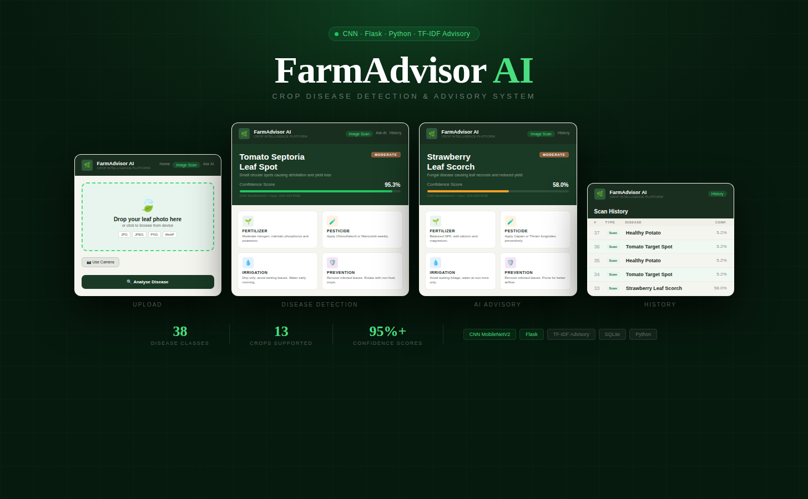

# 🌿 FarmAdvisor AI — Crop Disease Detection System

An AI-powered crop disease detection and advisory system built with Python, CNN, and Flask. Upload a plant leaf image to instantly detect diseases and get farming advice.

---

## 🚀 Features

- 🔍 **Image-based Disease Detection** — Upload a leaf image and get instant CNN-based prediction
- 💬 **Text Advisory System** — Ask farming questions and get AI-powered answers (TF-IDF + Random Forest)
- 🌐 **Flask Web App** — Clean, responsive web interface
- 🗃️ **History Tracking** — View past scans and queries stored in local database
- 📊 **21 Disease Classes** across 13 crops supported

---

## 🌱 Supported Crops & Diseases (38 Classes)

| Crop | Diseases Detected |
|------|-------------------|
| Apple | Apple Scab, Black Rot, Cedar Apple Rust, Healthy |
| Blueberry | Healthy |
| Cherry | Healthy, Powdery Mildew |
| Corn (Maize) | Cercospora Leaf Spot, Common Rust, Northern Leaf Blight, Healthy |
| Grape | Black Rot, Esca (Black Measles), Leaf Blight, Healthy |
| Orange | Haunglongbing (Citrus Greening) |
| Peach | Bacterial Spot, Healthy |
| Pepper (Bell) | Bacterial Spot, Healthy |
| Potato | Early Blight, Late Blight, Healthy |
| Raspberry | Healthy |
| Soybean | Healthy |
| Squash | Powdery Mildew |
| Strawberry | Leaf Scorch, Healthy |
| Tomato | Bacterial Spot, Early Blight, Late Blight, Leaf Mold, Septoria Leaf Spot, Spider Mites, Target Spot, Mosaic Virus, Yellow Leaf Curl Virus, Healthy |

---

## 🛠 Tech Stack

- **Backend:** Python 3, Flask
- **ML Model:** CNN (Convolutional Neural Network) — TensorFlow/Keras
- **Text Advisory:** TF-IDF Vectorizer + Random Forest Classifier
- **Database:** SQLite
- **Frontend:** HTML, CSS, JavaScript

---

## 📁 Project Structure

```
farmer-smart-crop-disease-detection/
├── app.py                  # Main Flask application
├── database.py             # Database setup and queries
├── train_image_model.py    # CNN model training script
├── train_text_model.py     # Text advisory model training
├── create_demo.py          # Demo data creation
├── models/
│   ├── plant_disease_model.h5   # Trained CNN model
│   ├── class_names.json         # Disease class labels
│   ├── text_model.pkl           # Text advisory model
│   └── text_labels.json         # Advisory labels
├── templates/              # HTML pages
├── static/                 # CSS and JS files
└── requirements.txt
```

---

## ⚙️ API Endpoints

| Endpoint | Method | Description |
|----------|--------|-------------|
| `/` | GET | Home dashboard |
| `/scan` | GET | Image scan page |
| `/scan` | POST | Upload image → JSON prediction |
| `/ask` | GET | Ask AI page |
| `/ask` | POST | Query text → JSON advisory |
| `/history` | GET | History page |
| `/api/history/clear` | POST | Clear all records |
| `/api/status` | GET | Model status JSON |

---

## ▶️ How to Run

**1. Clone the repository**
```bash
git clone https://github.com/dent581/farmer-smart-crop-disease-detection.git
cd farmer-smart-crop-disease-detection
```

**2. Install dependencies**
```bash
pip install -r requirements.txt
```

**3. Run the app**
```bash
python app.py
```

**4. Open in browser**
```
http://localhost:5000
```

---

## 📋 Requirements

- Python 3.8+
- TensorFlow
- Flask
- scikit-learn
- OpenCV
- Pillow

Install all with:
```bash
pip install -r requirements.txt
```
---
Built with ❤️ for farmers

## 📄 License

MIT License
